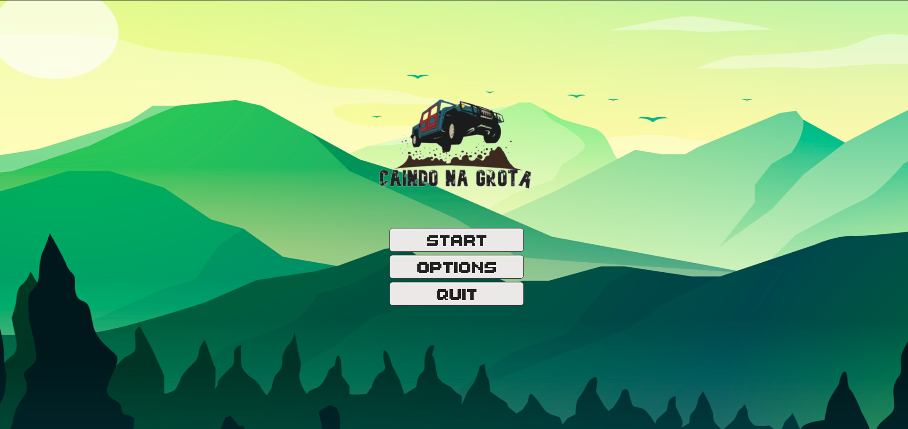
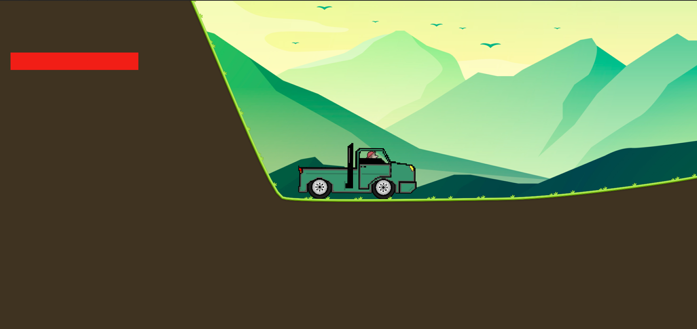
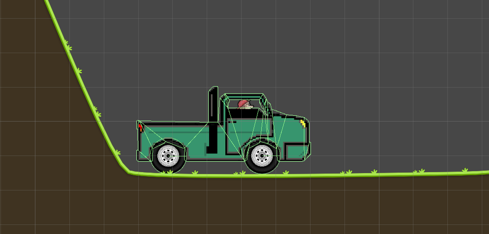
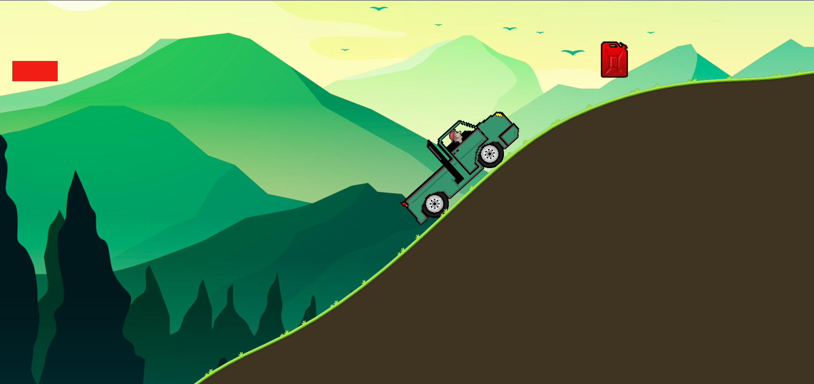
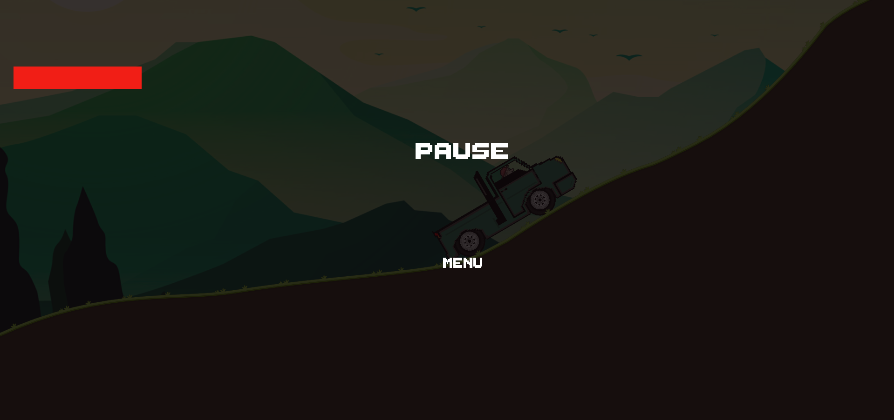
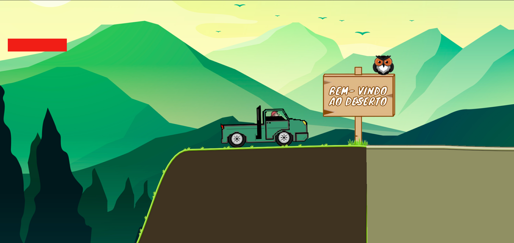

<html><head>

<p align="top">
<a href="https://web.satc.edu.br/"></a></p>
</p>

<font face="Bahnschrift Condensed" size="7" color="#C1CDC1">
<h2><b><p align="center">Falling the Grotto </b></h3>

</p>
</font>
<h3><b><p align="left">SOBRE O PROJETO </b></h3>
Falling the Grotto(Caindo na Grota) se trata de um jogo 2D, desenvolvido na disciplina de jogos digitais na 3ª fase do curso técnico de informática SATC.</p>

<br>

<hr size="4" width="100%" color="#0E0B16">

<h3><b><p align="left">OBJETIVO </b></h3>
O jogo tem por objetivo recolher três peças mecânicas (Suspensão, rodas e motor) que estão espalhadas pelo mapa, e entregá-las em uma residência localizada no fim do percurso. Para isso, Valdivino(Personagem principal) entra em sua camionete e sai em busca das mesmas, percorrendo longos campos, desertos e alguns desafios. Mas para isso deve estar sempre atento a quantidade de combustível restante, que ao decorrer do caminho, pode acabar. </p>

<br>
 
<hr size="4" width="100%" color="#0E0B16">
<h3><b><p align="center">PARTES A SEREM ENCONTRADAS</p></b></h3>
<p align="center">

</p>
<hr size="4" width="100%" color="#0E0B16">

<h3><b><p align="left">MENU </b></h3>
Menu simples, com opções de Start Game e Quit Game.</p>
<p align="left"></p>


<details>

<br>

<p align="center">
<B>CÓDIGO DO MENU</B>
</p>


```C#
using System.Collections;
using System.Collections.Generic;
using UnityEngine;
using UnityEngine.SceneManagement;
using UnityEngine.UI;

public class Menu : MonoBehaviour
{

    void Start()
    {
        
    }

    // Update is called once per frame
    void Update()
    {
        
    }

    public void StartGame()
    {
        SceneManager.LoadScene("JOGO");
    }
    public void QuitGame()
    {
        UnityEditor.EditorApplication.isPlaying = false;
        //Application.Quit();
    }
}
```
<summary><b>Código &#x2714;</b> </summary>
</details>
<br><br>


<h3><b><p align="left">IN-GAME </b></h3>
Começo do jogo, pode-se notar valdivino pronto para iniciar sua jornada.</p>
<p align="left"></p>

<br><br>
<h3><b><p align="left">MOVIMENTAÇÃO DO VEÍCULO </b></h3>
O carro é feito através das físicas 2D(no caso Rigidbody2D), onde é aplicado para cada uma das rodas e no chassi. São criadas variáveis de torque e velocidade para dar movimento ao veículo, que logo após serão introduzidas no Rigidbody da roda e do chassi.</p>
<p align="left"></p>


<details>

<br>

<p align="center">
<B>CÓDIGO DA MOVIMENTAÇÃO DO VEÍCULO</B>
</p>

```C#
using System.Collections;
using System.Collections.Generic;
using UnityEngine;

public class CarMoviment : MonoBehaviour
{
    public Rigidbody2D carRig;
    public Rigidbody2D backWheelRig;
    public Rigidbody2D frontWheelRig;
    
    public float speed;
    public float torque;

    private float movement;
    

    void Update()
    {
        movement = Input.GetAxis("Horizontal"); 
    }

    private void FixedUpdate()
    {
        backWheelRig.AddTorque(-movement * speed * Time.fixedDeltaTime);
        frontWheelRig.AddTorque(-movement * speed * Time.fixedDeltaTime);
        carRig.AddTorque(-movement * torque * Time.fixedDeltaTime);
    }
}

```

<summary><b>Código &#x2714;</b> </summary>
</details>
<br><br>

<h3><b><p align="left">GASOLINA </b></h3>
Sistema de combustível para camionete. Cada vez que valdivino pisa no acelerador, um parte da gasolina é consumida. Para reabastecer pode-se encontrar galões espalhados pelo mapa. Caso acabe a gasolina, o jogo reiniciará na tela do menu.</p>
<p align="left"></p>


<details>

<br>

<p align="center">
<B>CÓDIGO DA GASOLINA</B>
</p>

```C#
using System.Collections;
using System.Collections.Generic;
using UnityEngine;
using UnityEngine.UI;
using UnityEngine.SceneManagement;

public class gasoline : MonoBehaviour
{
    public Image gasol;
    void Start()
    {
        
    }

    // Update is called once per frame
    void Update()
    {
        if (Input.GetAxisRaw("Horizontal")>0)
        {
           gasol.fillAmount -= 0.0003000f; 
        }

        if (gasol.fillAmount <= 0f)
        {
            SceneManager.LoadScene("Menu");
        }
       
    }

    public void AddFuel()
    {
        gasol.fillAmount += 0.9f;
    }
}
```
<br><br>
<p align="center">
<B>CÓDIGO DO GALÃO</B>
</p>

```C#
using System.Collections;
using System.Collections.Generic;
using UnityEngine;

public class fuel : MonoBehaviour
{
    public gasoline gasol;
     private void OnTriggerEnter2D(Collider2D collision)
      {
        if(collision.CompareTag("Player"))
        {
            gasol.AddFuel();
            Destroy(gameObject);
        }
        
    }
}
```

<summary><b>Código &#x2714;</b> </summary>
</details>
<br><br>

<h3><b><p align="left">PAUSE </b></h3>
Pause simples, com opções de continuar ou voltar para o menu. Ao apertar no pause, o jogo congela instantaneamente para que não tenha problemas na gameplay.</p>
<p align="left"></p>


<details>

<br>

<p align="center">
<B>CÓDIGO DO PAUSE</B>
</p>


```C#
using System.Collections;
using System.Collections.Generic;
using UnityEngine;
using UnityEngine.SceneManagement;

public class PAUSE : MonoBehaviour
{
    private bool isPaused;
    public GameObject pausePanel;
    public string cena;
    void Start()
    {
        Time.timeScale = 1f;
    }

    // Update is called once per frame
    void Update()
    {
       if (Input.GetKeyDown(KeyCode.Escape)) 
       {
           PauseScreen();
       }
    }

    void PauseScreen()
    {
        if (isPaused)
        {
            isPaused = false;
            Time.timeScale = 1f;
            pausePanel.SetActive(false);
            Cursor.lockState = CursorLockMode.Locked;
            Cursor.visible = false;
        }
        else
        {
            isPaused = true;
            Time.timeScale = 0f;
            pausePanel.SetActive(true);
            Cursor.lockState = CursorLockMode.None;
            Cursor.visible = true;
        }
    }

    public void BackToMenu()
    {
        SceneManager.LoadScene(cena);
    }
}
```
<summary><b>Código &#x2714;</b> </summary>
</details>
<br><br>
<h3><b><p align="left">DIVISA ENTRE BIOMAS </b></h3>
Nessa parte ocorre a divisão entre o bioma do campo e do deserto.</p>
<p align="left"></p>

<hr size="4" width="100%" color="#0E0B16">
<h3><b><p align="center">LINGUAGEM</p></b></h3>
A linguagem utilizada no projeto foi o C#(C Sharp), aplicada na plataforma de desenvolvimento UNITY.
<p align="center">
</p>
<hr size="4" width="100%" color="#0E0B16">

<font face="Bahnschrift Condensed" size="5" color="#C1CDC1">
<p align="left">
&#x1F920; Olá, eu sou o Victor. 
</p></font>
<details>
<summary> <b>Um pouco mais sobre mim... </b><i>(Aperta aí)</i> </summary>
&#x1F4BB;Cursando Informática no Colégio Satc <br> 
&#x1F4BB;Aluno do 3° ano E.M do Colégio Satc <br>
&#x1F575;Futuro estagiário <br>
&#x1F5FA;Cocal do Sul-SC	

<br>

&#x1F4F2;Me siga no [instagram](https://www.instagram.com/victor__bonomi/?hl=pt-br)!
 

</details>
<br>

&#x1F4D6;<i>"15 anos a trás, a internet era uma maneira de fugir do mundo real, hoje o mundo real é uma maneira de fugir da internet".<br> 
by: John </i> 


 
</p>
</body></html>